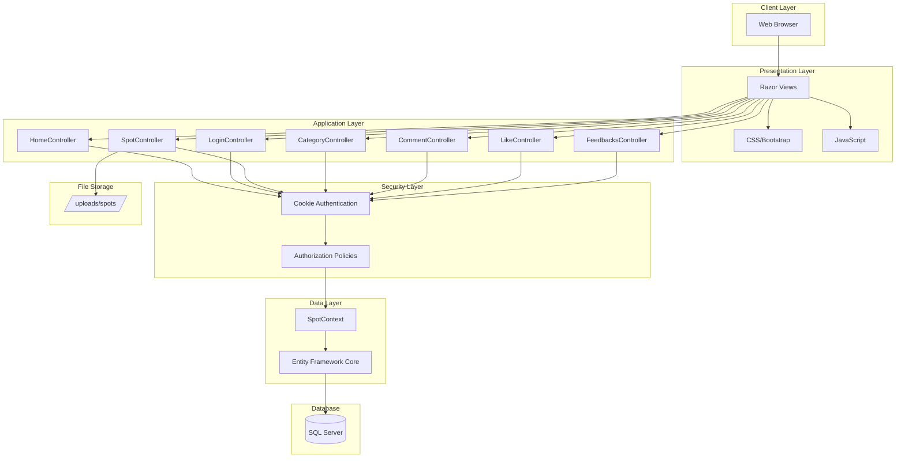
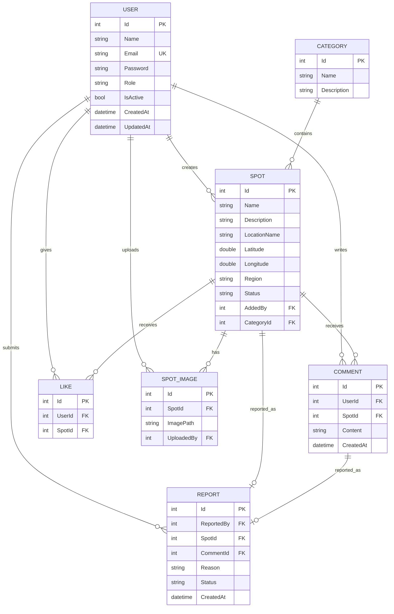
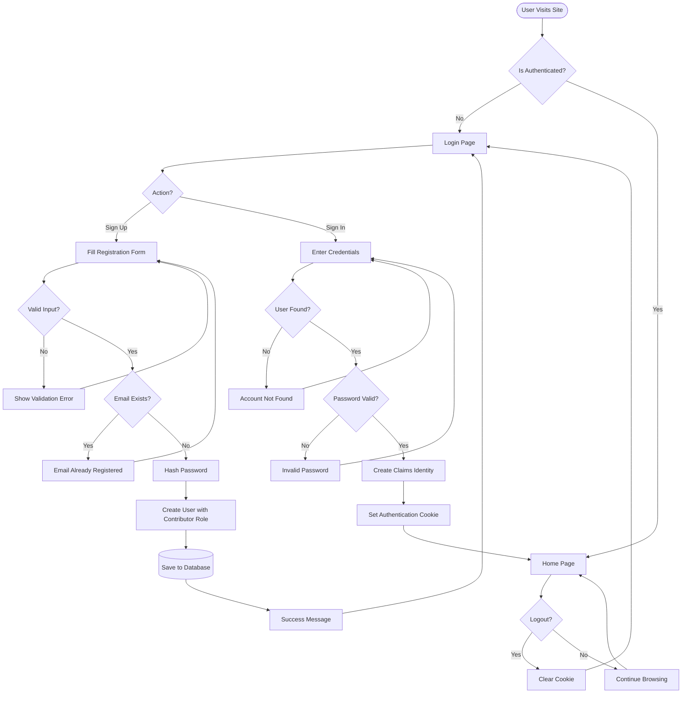
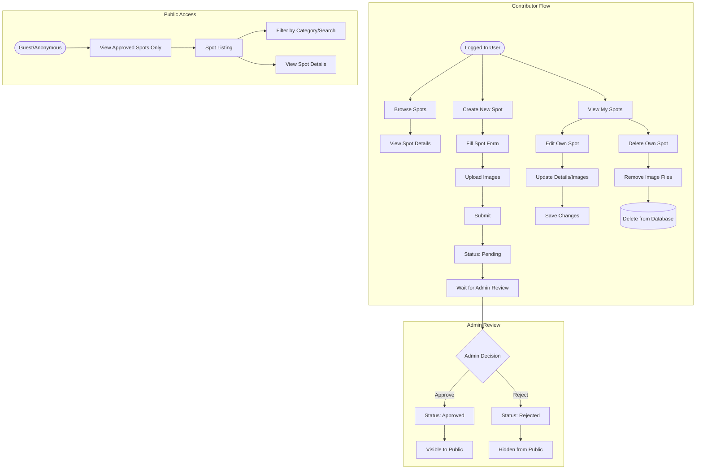
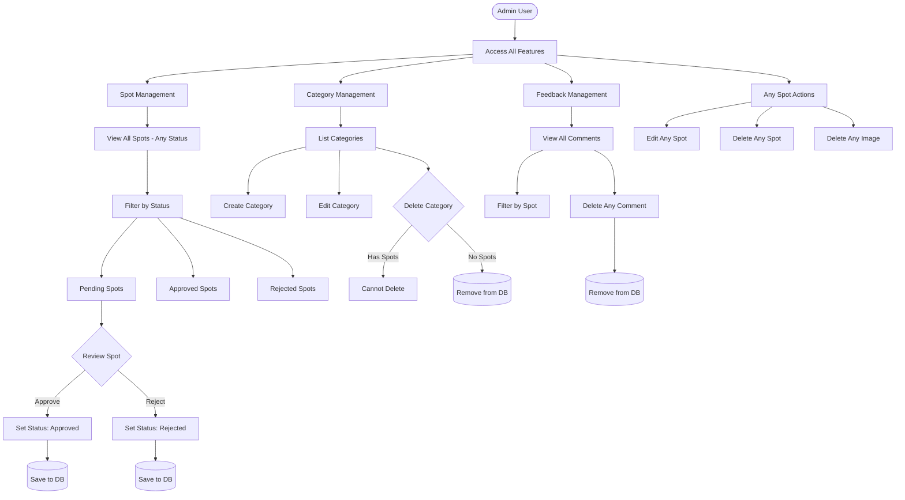
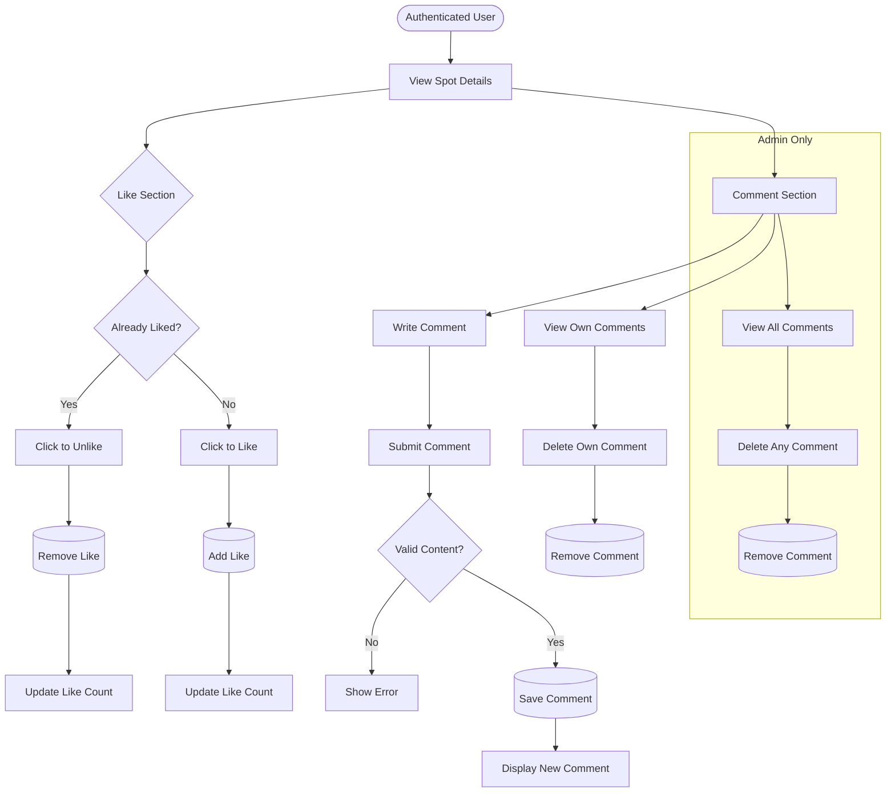
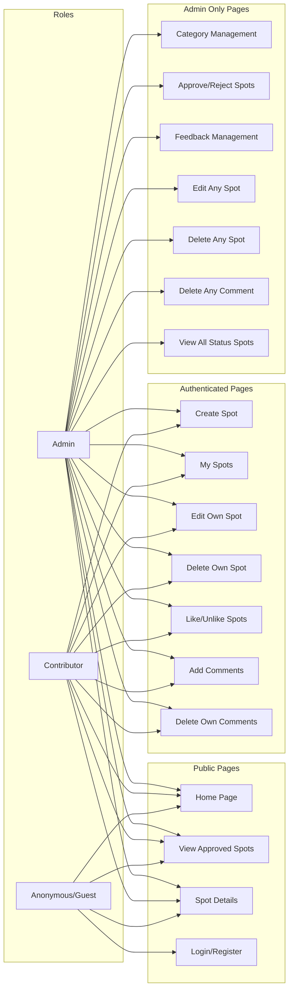
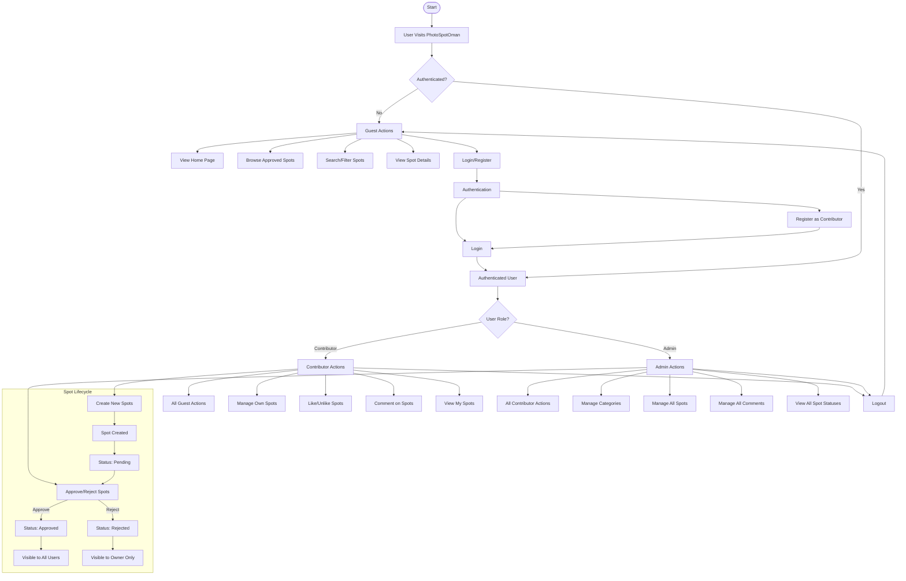
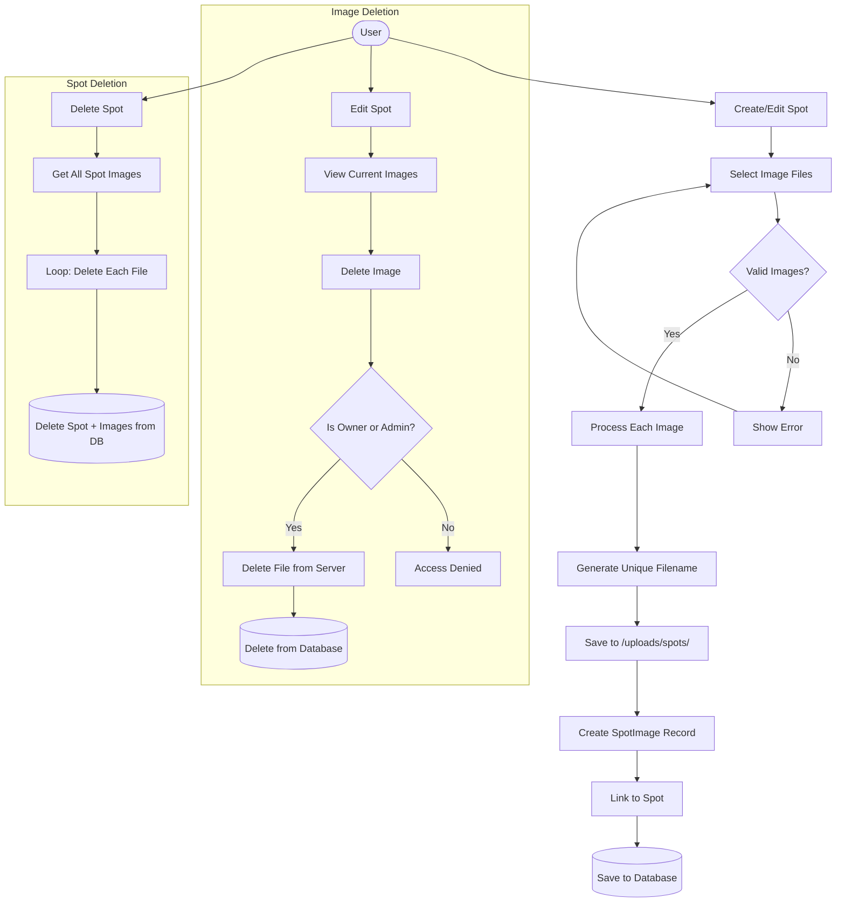
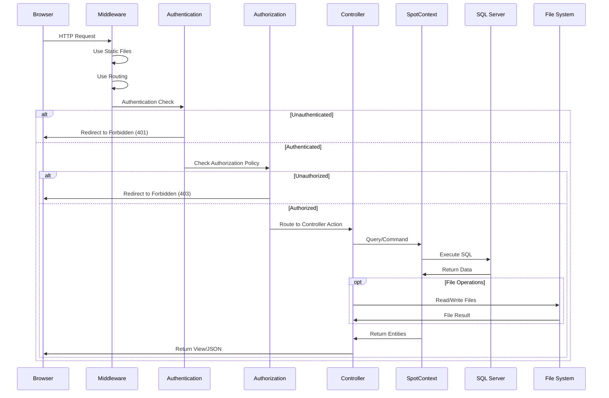

# PhotoSpotOman - System Workflow Diagrams

## 1. System Architecture Overview

---

## 2. Data Model / Entity Relationship Diagram

---

## 3. User Authentication Flow

---

## 4. Spot Management Workflow

---

## 5. Admin Workflow

---

## 6. User Interaction Flow (Likes & Comments)

---

## 7. Authorization & Access Control

---

## 8. Complete Application Flow

---

## 9. Image Upload & Management Flow

---

## 10. API Request Flow

---

## Legend

| Symbol | Meaning |
|--------|---------|
| `([text])` | Start/End Point |
| `[text]` | Process/Action |
| `{text}` | Decision |
| `[(text)]` | Database Operation |
| `[/text/]` | File Storage |
| `-->` | Flow Direction |
| `-->\|label\|` | Conditional Flow |

---

## Controllers Summary

| Controller | Access Level | Purpose |
|------------|--------------|---------|
| `HomeController` | Public | Home page, popular spots display |
| `LoginController` | Public | User authentication (SignIn/SignUp) |
| `SpotController` | Mixed | Spot CRUD, approval (Admin), filtering |
| `CategoryController` | Admin Only | Category CRUD management |
| `CommentController` | Authenticated | Comment CRUD on spots |
| `LikeController` | Authenticated | Like/unlike toggle on spots |
| `FeedbacksController` | Admin Only | View/manage all comments |
| `LogOutController` | Authenticated | User logout |
| `PageController` | Public | Error pages (Forbidden) |

---

## Authorization Policies

| Policy | Roles | Usage |
|--------|-------|-------|
| `AdminOnly` | Admin | Category management, spot approval, feedback management |
| `ContributorOnly` | Contributor | (Reserved for future use) |
| `AnyRole` | Admin, Contributor | Spot creation, commenting, liking |

